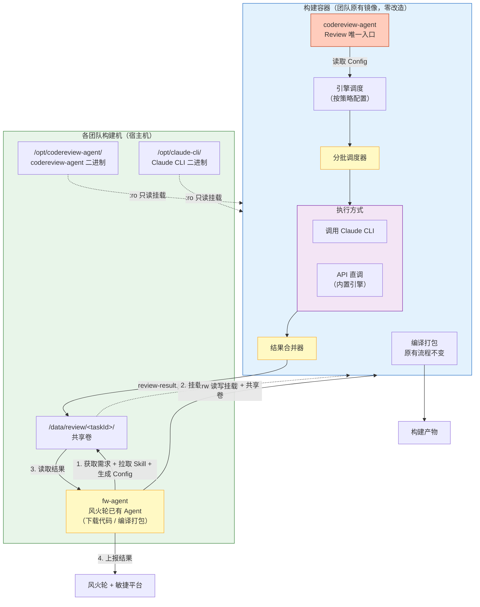
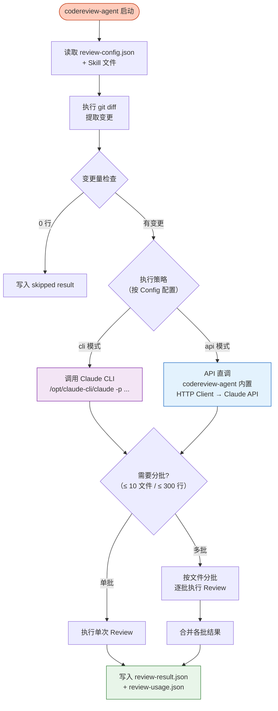
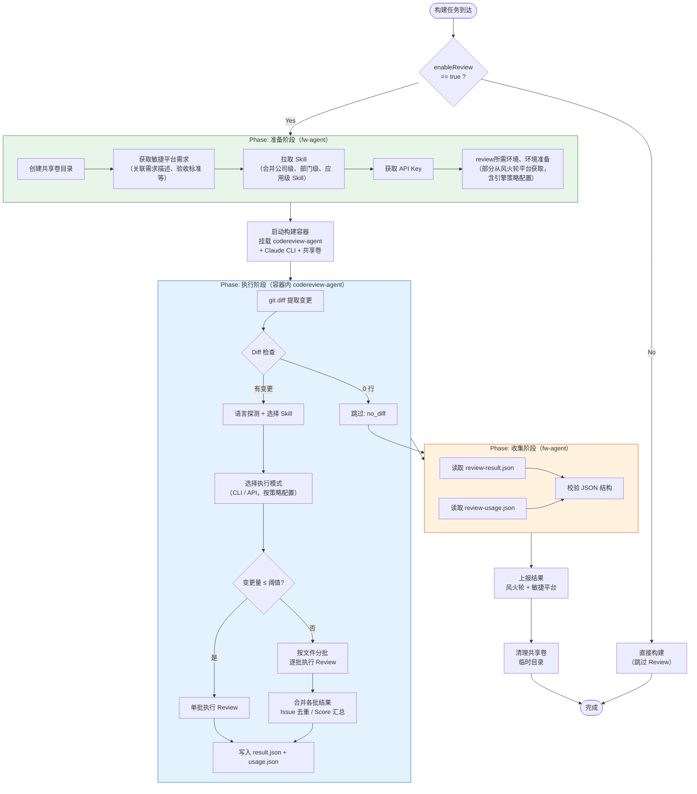
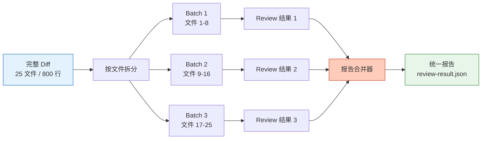
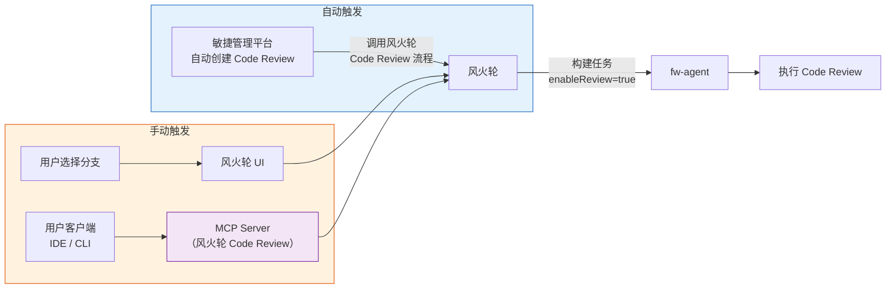
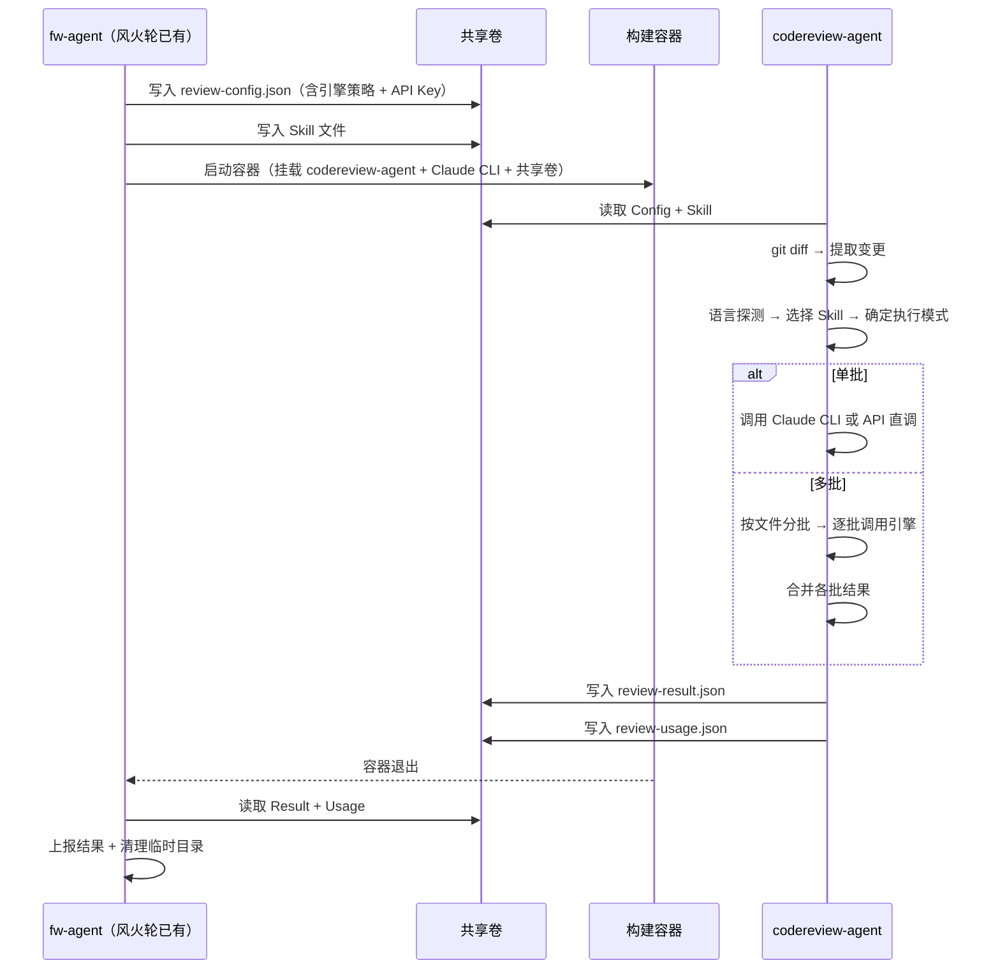
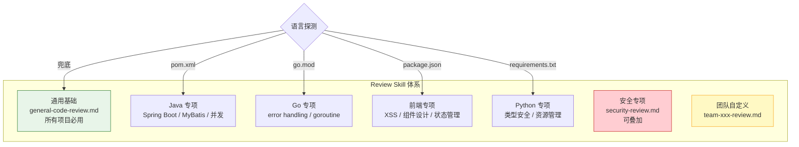
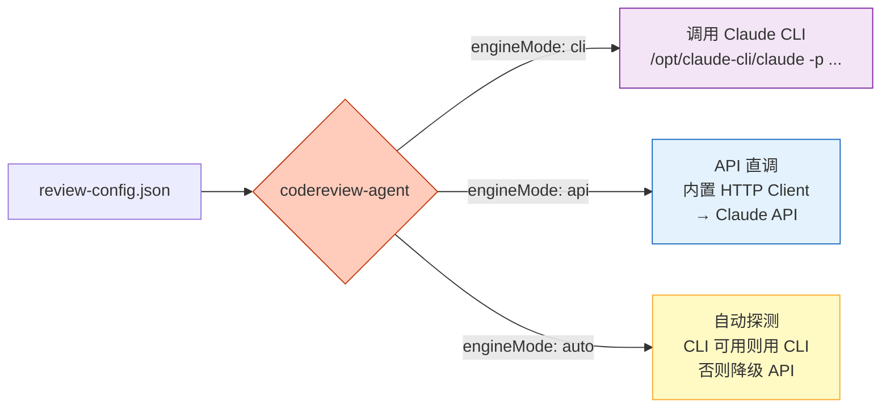
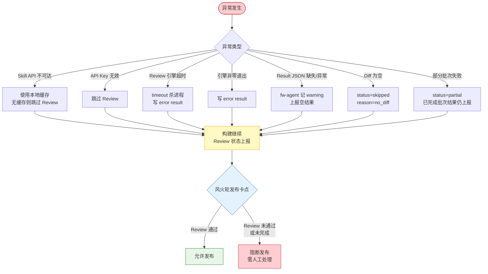

# CI/CD 统一 AI Code Review 技术方案

## 一、方案概述

本方案将 AI Code Review 能力无缝集成到现有 CI/CD 构建流程中，实现 **PR 提交自动触发代码审查**，零改造团队构建镜像。

**核心价值：**

- **零侵入**：不修改任何团队的构建镜像和构建脚本，通过 Volume 挂载 codereview-agent + CLI 注入 Review 能力
- **统一执行体**：自研 codereview-agent（Go 静态二进制）作为容器内唯一 Review 入口，支持调用 Claude CLI 或 API 直调等多种执行方式
- **大 Diff 分批审查**：变更量超过阈值时自动按文件分批 Review，各批结果智能合并为统一报告
- **安全隔离**：所有 AI 调用在构建容器内完成，API Key 不落盘，容器销毁即清除
- **发布卡点**：Review 结果接入风火轮 CI/CD 流程统一卡点，未通过 Review 的代码不允许发布

---

## 二、整体架构



**架构要点：**
- **fw-agent**：风火轮已有的构建 Agent（负责下载代码、编译打包等），扩展 Review 相关逻辑——准备共享卷、获取敏捷平台需求、拉取 Skill、生成 Config，容器退出后收集结果上报
- **codereview-agent**：新开发的 Go 静态二进制（`CGO_ENABLED=0`），通过 Volume 挂载到容器，是容器内 Review 的唯一执行入口
- **Claude CLI**：同样通过 Volume 只读挂载到容器（不修改原有镜像），供 codereview-agent 调用
- **执行方式可配置**：codereview-agent 根据 review-config.json 中的策略配置，选择调用 Claude CLI 或通过 API 直调执行 Review
- **分批调度 + 结果合并**：大 Diff 自动拆分为多批，逐批执行后合并为统一报告

---

## 三、codereview-agent 设计

codereview-agent 是一个 Go 静态编译的二进制文件，容器内通过共享卷读取配置，执行 Code Review，输出标准化结果。

### 执行方式



### 两种执行模式

| 模式 | 调用方式 | 适用场景 | 说明 |
|------|---------|---------|------|
| **CLI 模式** | `os/exec` 调用 `/opt/claude-cli/claude -p "..." --output-format json` | Claude CLI 可运行的环境（glibc ≥ 2.17） | 利用 Claude CLI 完整能力，输出结构化 JSON |
| **API 模式** | codereview-agent 内置 HTTP Client，直接调用 Claude API | CLI 不可运行的环境，或需要精细控制（多模型编排等） | codereview-agent 自建 Tool Use 循环，支持未来扩展 Codex / Gemini API |

**模式选择策略：**
1. 按 `review-config.json` 中的 `engineMode` 配置优先
2. 未指定时自动探测：检测 Claude CLI 是否可执行（`/opt/claude-cli/claude --version`），可执行则用 CLI 模式，否则降级到 API 模式

### codereview-agent 调用方式

```bash
/opt/codereview-agent/codereview-agent \
    --config /review/config/review-config.json \
    --output-dir /review/output/
```

codereview-agent 内部完成所有工作：git diff → 语言探测 → Skill 选择 → 分批策略 → 调用引擎 → 结果合并 → 写入 result/usage JSON。

---

## 四、核心流程

### 一次 Code Review 的完整生命周期



### 分批 Review 与报告合并

当变更量超过阈值时，codereview-agent 自动进入分批模式：



**报告合并策略：**

| 维度 | 合并规则 |
|------|---------|
| **Issues** | 各批 Issues 汇总，按 file + line 去重，保留 confidence 更高的条目 |
| **Score** | 各批 Score 按变更行数加权平均 |
| **Summary** | 基于各批 Summary 生成整体摘要 |
| **Usage** | inputTokens / outputTokens / costUsd 各批累加 |
| **Status** | 全部成功 → `completed`；部分失败 → `partial`（已完成批次结果仍保留上报） |

---

## 五、触发机制



| 触发方式 | 触发源 | 参数来源 |
|---------|--------|---------|
| **自动触发** | 敏捷管理平台自动创建 Code Review → 调用风火轮 Code Review 流程 | `sourceBranch`、`targetBranch`、`prUrl` 自动填充 |
| **手动触发 — UI** | 用户在风火轮 UI 选择项目和分支，点击"Code Review" | 用户手动选择源/目标分支 |
| **手动触发 — MCP** | 用户在客户端（IDE / Claude CLI）通过 MCP Server 调用风火轮 Code Review | 客户端自动获取当前项目、分支信息，通过 MCP 协议传递 |

---

## 六、数据交换协议

fw-agent 与构建容器之间通过**共享卷（Shared Volume）**进行数据交换，纯文件协议，无网络通信。

### 共享卷目录结构

```
/data/review/<taskId>/
├── config/
│   ├── review-config.json       ← fw-agent 写入，codereview-agent 读取
│   └── skills/                  ← fw-agent 写入，codereview-agent 读取
│       ├── general-code-review.md
│       └── java-review.md
└── output/
    ├── diff.patch               ← codereview-agent 写入
    ├── review-result.json       ← codereview-agent 写入，fw-agent 读取（核心结果）
    └── review-usage.json        ← codereview-agent 写入，fw-agent 读取（用量统计）
```

### 数据流向



### review-result.json

```json
{
  "status": "completed",
  "engineMode": "cli",
  "summary": "本次变更涉及 8 个文件，发现 2 个安全风险",
  "score": 78,
  "issues": [
    {
      "file": "src/main/java/com/xxx/UserService.java",
      "line": 42,
      "severity": "error",
      "category": "security",
      "message": "SQL 字符串拼接存在注入风险",
      "suggestion": "使用 MyBatis #{} 参数绑定",
      "confidence": "high"
    }
  ],
  "errorCount": 2,
  "warningCount": 3,
  "suggestionCount": 5,
  "batches": [
    {
      "batchId": 1,
      "files": ["UserService.java", "AuthController.java"],
      "status": "completed",
      "issueCount": 2,
      "score": 75
    },
    {
      "batchId": 2,
      "files": ["OrderService.java", "PaymentService.java"],
      "status": "completed",
      "issueCount": 3,
      "score": 80
    }
  ]
}
```

> `batches` 字段仅在分批 Review 时出现，单批时为 `null`。

---

## 七、Skill 体系

Skill 是可配置的 Review 规则集，以 Markdown 文件形式管理，由研发工作台统一维护。



**Skill 选择策略：**

| 优先级 | 条件 | 行为 |
|-------|------|------|
| 1 | 指定 `skillId` | 直接使用指定 Skill |
| 2 | 指定 `language` | 匹配对应语言 Skill |
| 3 | 都未指定 | 自动探测项目文件（pom.xml / go.mod / package.json）→ 选择对应 Skill |
| 4 | 探测失败 | 使用通用 Skill（general-code-review.md） |

**Skill 缓存策略：** fw-agent 作为常驻进程，启动时全量拉取 Skill 并缓存到本地磁盘，每 5 分钟增量刷新。构建时从缓存读取，研发工作台 API 不可达时使用本地缓存兜底。

---

## 八、执行模式配置

codereview-agent 支持两种执行模式，通过 `review-config.json` 中的策略灵活配置。



### 模式对比

| 模式 | 调用方式 | 环境要求 | 适用场景 |
|------|---------|---------|---------|
| **CLI** | `os/exec` 调用 Claude CLI | glibc ≥ 2.17 | CLI 可运行的标准构建镜像 |
| **API** | codereview-agent 内置 HTTP Client 直调 API | **无额外依赖** | CLI 无法运行的精简镜像（alpine/musl），或需精细控制（多模型编排等） |
| **auto**（默认） | 自动探测 CLI 可用性，优先 CLI，不可用则降级 API | — | 通用默认策略 |

### review-config.json 配置示例

```json
{
  "version": "1.0",
  "taskId": "build-12345",
  "projectName": "user-service",
  "triggerType": "pr",
  "sourceBranch": "feature/add-auth",
  "targetBranch": "main",
  "engineMode": "auto",
  "model": "claude-sonnet-4-6",
  "apiKey": "sk-ant-...",
  "skillFile": "config/skills/java-review.md",
  "outputDir": "output/",
  "batchThreshold": {
    "maxFiles": 10,
    "maxLines": 300
  },
  "timeoutSeconds": 300,
  "prUrl": "https://bitbucket.example.com/.../pull-requests/123"
}
```

---

## 九、错误处理与发布卡点

**核心原则：Review 异常不阻断构建，但 Review 结果作为发布卡点 — 未通过 Review 的代码不允许发布。**



**卡点规则：**
- 构建阶段：Review 异常不阻断构建，确保构建产物正常产出
- 发布阶段：风火轮 CI/CD 流程统一卡点判断，Review 状态为 `completed` 且无 `error` 级别 Issue 时方可发布
- Review 跳过或失败的代码，需人工确认后才能放行发布

---

## 十、关键设计决策

| 决策项 | 选择 | 理由 |
|--------|------|------|
| **codereview-agent 语言** | Go（`CGO_ENABLED=0` 静态编译） | 零依赖，兼容所有构建镜像（alpine/debian/centos/distroless） |
| **CLI 挂载方式** | Volume 只读挂载（不改镜像） | 避免修改各团队构建镜像，后续维护成本低 |
| **执行模式** | CLI + API 双模式，自动降级 | CLI 可用时利用其完整能力；不可用时 API 直调兜底 |
| **Skill 拉取位置** | fw-agent 宿主机 | fw-agent 已集成 DNA SDK，常驻进程可缓存，容器启动前预备完成 |
| **通信方式** | 共享卷（文件协议） | 无网络通信，简单可靠 |
| **Diff 策略** | 三点 diff（target...HEAD） | 只显示源分支增量变更，排除 lock 文件和 vendor 目录 |
| **分批阈值** | 默认 ≤ 10 文件 / ≤ 300 行 | 可通过 `batchThreshold` 配置调整 |
| **超时策略** | 默认 5 分钟 / 批 | 覆盖绝大多数 Review 场景，超时自动杀进程 |

---

## 十一、接口概览

### 研发工作台 DNA RPC 接口

| 接口 | 用途 | 调用方 |
|------|------|--------|
| `ReviewSkillService.ListSkills` | 获取 Skill 列表 | fw-agent |
| `ReviewSkillService.GetSkill` | 获取 Skill 内容 | fw-agent |
| `ReviewSkillService.ResolveSkill` | 按项目/语言/团队智能解析 Skill | fw-agent |
| `ReviewKeyService.GetTemporaryKey` | 获取临时 API Key | fw-agent |
| `ReviewUsageService.ReportUsage` | 上报 Review 用量 | fw-agent |

### 构建任务参数扩展

风火轮下发的构建任务新增 `review` 字段：

```json
{
  "taskId": "build-12345",
  "review": {
    "enableReview": true,
    "triggerType": "pr",
    "engineMode": "auto",
    "sourceBranch": "feature/add-auth",
    "targetBranch": "main",
    "prUrl": "https://bitbucket.example.com/.../pull-requests/123",
    "skillId": "",
    "language": "java",
    "maxWaitSeconds": 300
  }
}
```

### 容器挂载配置

fw-agent 启动构建容器时新增的 Volume 挂载：

```
-v /opt/codereview-agent:/opt/codereview-agent:ro    ← codereview-agent 二进制
-v /opt/claude-cli:/opt/claude-cli:ro                ← Claude CLI 二进制
-v /data/review/<taskId>:/review:rw                  ← 共享卷（Config + Result）
```

容器内 Review 执行命令：

```bash
/opt/codereview-agent/codereview-agent \
    --config /review/config/review-config.json \
    --output-dir /review/output/
```
